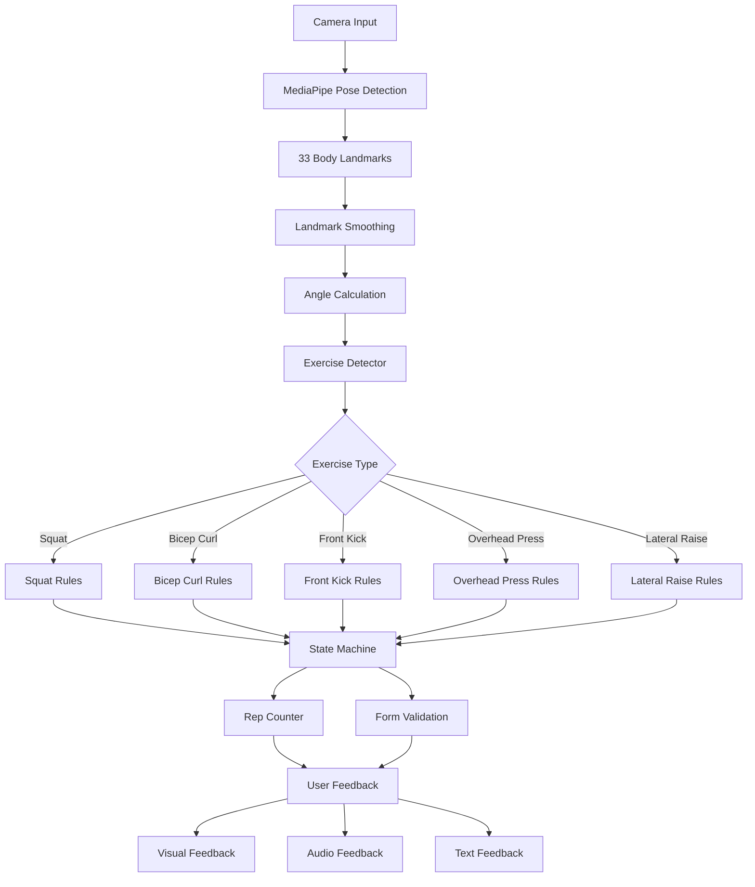
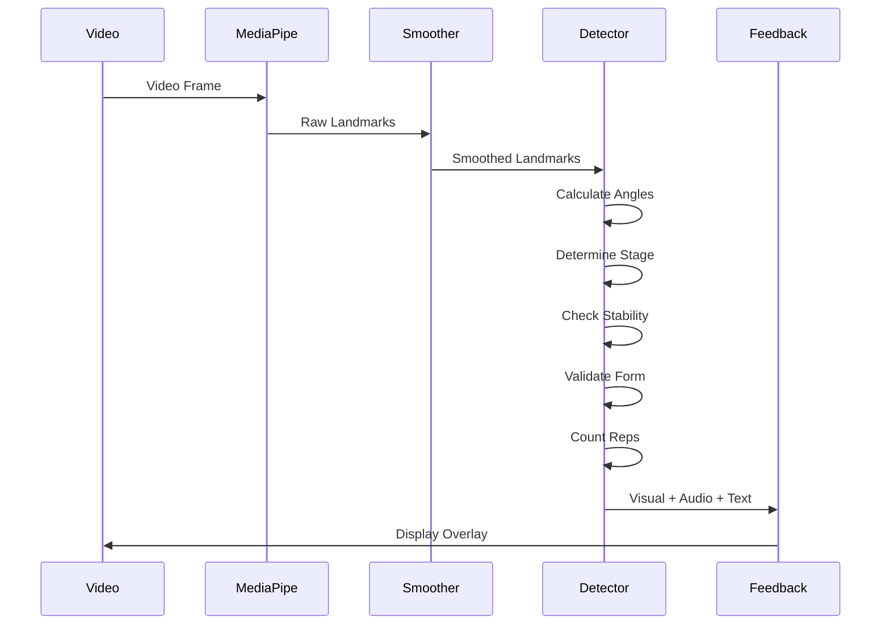
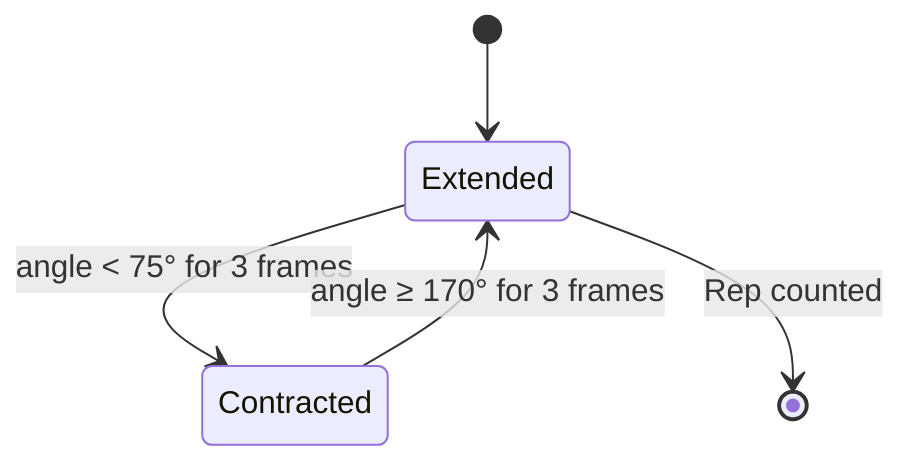

# AI-Powered Coach

## Table of Contents

1. [Overview](#overview)
2. [Project Structure](#project-structure)
3. [Methodology of Exercise Detection](#methodology-of-exercise-detection)
   - [MediaPipe Pose Landmarker](#mediapipe-pose-landmarker)
   - [Landmark Smoothing](#landmark-smoothing)
   - [Exercise Detection System](#exercise-detection-system)
   - [Form Validation Rules](#form-validation-rules)
   - [Repetition Counting](#repetition-counting)
4. [Accuracy of Detectors](#accuracy-of-detectors)
5. [Other Features](#other-features)
6. [Technology Stack](#technology-stack)

## Overview

AI-Powered Coach is a web application that provides real-time exercise form detection and coaching. The system uses computer vision technology to track body movements through a camera and provides instant feedback on exercise form and repetition counting. The application helps users perform exercises correctly to maximize effectiveness and prevent injuries.

The system supports five exercises: Squat, Bicep Curl, Front Kick, Overhead Press, and Lateral Raise, each available at three difficulty levels (beginner, intermediate, advanced). Users can track their progress, set fitness goals, and receive personalized coaching through an AI chatbot.

## Project Structure

```
AI-Powered-Coach/
│
├── frontend/                          # React application
│   ├── src/
│   │   ├── components/                # Reusable UI components
│   │   │   ├── navbar.jsx
│   │   │   ├── ProtectedRoute.jsx
│   │   │   ├── Toast.jsx
│   │   │   ├── ToastContainer.jsx
│   │   │   └── ModalToast.jsx
│   │   │
│   │   ├── context/                   # State management
│   │   │   ├── UserContext.jsx
│   │   │   ├── WorkoutContext.jsx
│   │   │   ├── GoalsContext.jsx
│   │   │   └── ToastContext.jsx
│   │   │
│   │   ├── pages/                     # Application pages
│   │   │   ├── HomePage/
│   │   │   │   ├── HomePage.jsx
│   │   │   │   ├── SignIn.jsx
│   │   │   │   ├── SignUp.jsx
│   │   │   │   ├── ProfileSetup.jsx
│   │   │   │   ├── ForgotPassword.jsx
│   │   │   │   └── HomeDashboard.jsx
│   │   │   │
│   │   │   ├── WorkoutsPage/
│   │   │   │   ├── LevelSelect.jsx
│   │   │   │   ├── ExerciseMenu.jsx
│   │   │   │   ├── DemoView.jsx
│   │   │   │   └── WorkoutSession/
│   │   │   │       ├── WorkoutSessionWrapper.jsx
│   │   │   │       ├── PoseCamera.jsx      # Camera and pose detection
│   │   │   │       ├── FeedbackPanel.jsx
│   │   │   │       ├── StatsPanel.jsx
│   │   │   │       ├── EndSessionButton.jsx
│   │   │   │       └── WorkoutSummary.jsx
│   │   │   │
│   │   │   ├── GoalsPage/
│   │   │   │   ├── GoalsDashboard.jsx
│   │   │   │   ├── SetGoals.jsx
│   │   │   │   ├── EnterWeight.jsx
│   │   │   │   ├── EditGoalWeight.jsx
│   │   │   │   └── UpdateWeight.jsx
│   │   │   │
│   │   │   ├── ProfilePage/
│   │   │   │   └── ProfileView.jsx
│   │   │   │
│   │   │   ├── SettingsPage/
│   │   │   │   ├── EditProfile.jsx
│   │   │   │   └── Logout.jsx
│   │   │   │
│   │   │   ├── FitnessChat.jsx        # AI chatbot interface
│   │   │   └── layout.jsx
│   │   │
│   │   ├── utils/                     # Core detection logic
│   │   │   ├── ExerciseDetector.js    # Exercise detection algorithms
│   │   │   ├── LandmarkSmoother.js    # Landmark smoothing
│   │   │   ├── SoundFeedback.js       # Audio feedback system
│   │   │   ├── uploadProfilePicture.js
│   │   │   └── migrateToFirebase.js
│   │   │
│   │   ├── lib/
│   │   │   └── firebase.js            # Firebase configuration
│   │   │
│   │   ├── adapter/
│   │   │   └── firebaseAdapter.js
│   │   │
│   │   ├── assets/                    # Images and sounds
│   │   │   └── ...
│   │   │
│   │   ├── sounds/                    # Audio feedback files
│   │   │   ├── bicep-curl.form.mp3
│   │   │   ├── front-kick.form.mp3
│   │   │   ├── squat.form.mp3
│   │   │   ├── overhead-press.form1.mp3
│   │   │   ├── overhead-press.form2.mp3
│   │   │   ├── lateral-raise.form1.mp3
│   │   │   ├── lateral-raise.form2.mp3
│   │   │   ├── encourage.mp3
│   │   │   ├── midway.mp3
│   │   │   └── starting.mp3
│   │   │
│   │   ├── App.jsx                    # Main application component
│   │   ├── main.jsx                   # Application entry point
│   │   ├── App.css
│   │   └── index.css
│   │
│   ├── accuracy.ipynb                 # Accuracy testing notebook
│   ├── test.csv                       # Unconstrained test results
│   ├── test_constrained.csv           # Constrained test results
│   ├── package.json
│   └── vite.config.js
│
└── backend/                           # Firebase backend
    ├── functions/
    │   ├── index.js                   # Cloud functions
    │   └── package.json
    │
    ├── firebase.json
    ├── firestore.rules
    ├── firestore.indexes.json
    └── storage.rules
```

## Methodology of Exercise Detection

The exercise detection system combines computer vision, biomechanical analysis, and state machine logic to provide accurate real-time feedback. The methodology involves several key components working together.



### MediaPipe Pose Landmarker

The system uses Google MediaPipe Pose Landmarker library to detect human body positions in real-time video. MediaPipe is a computer vision framework that identifies 33 key points on the human body.

**Key Landmarks Used:**

- Shoulders (11, 12): Upper body reference points
- Elbows (13, 14): Arm joint tracking
- Wrists (15, 16): Hand position tracking
- Hips (23, 24): Core body reference points
- Knees (25, 26): Leg joint tracking
- Ankles (27, 28): Lower leg reference points

**Configuration:**

The pose landmarker runs with the following settings:

- **Model**: Pose Landmarker Full (high accuracy model)
- **Running Mode**: Video (optimized for continuous frame processing)
- **Number of Poses**: 1 (single person tracking)
- **Detection Confidence**: 0.5 (minimum confidence for initial detection)
- **Presence Confidence**: 0.5 (minimum confidence for landmark visibility)
- **Tracking Confidence**: 0.7 (minimum confidence for tracking between frames)
- **Delegate**: GPU (with CPU fallback if GPU is unavailable)

**Visibility Filtering:**

Only landmarks with visibility and presence scores above 0.5 are used in calculations. This ensures that partially occluded or uncertain body parts do not affect exercise detection accuracy.

### Landmark Smoothing

Raw pose landmarks contain noise and jitter due to detection uncertainty and small movements. The system applies Exponential Moving Average (EMA) smoothing to create stable, reliable landmark positions.

**Smoothing Algorithm:**

```
smoothed_value = α × current_value + (1 - α) × previous_value
```

Where:
- α (alpha) = 0.3 for landmarks (lower value = smoother motion)
- α (alpha) = 0.4 for calculated angles (moderate smoothing)

**Benefits:**

- Reduces false positives from small movements
- Creates smoother skeleton visualization
- Improves angle calculation accuracy
- Maintains responsiveness to actual movements

The smoother resets when no pose is detected, preventing stale data from affecting new detections.

### Exercise Detection System

Each exercise uses a state machine approach with angle-based rules. The detector calculates angles between body landmarks and determines the current stage of movement.

**Angle Calculation:**

The system calculates angles between three points using vector mathematics:

```
angle = atan2(c.y - b.y, c.x - b.x) - atan2(a.y - b.y, a.x - b.x)
angle_degrees = |angle × 180 / π|
if angle_degrees > 180: angle_degrees = 360 - angle_degrees
```

Where points a, b, c form an angle at point b.

**Detection Flow:**



**Stability Requirements:**

To prevent false detections from transitional movements, the system requires a movement to be stable for multiple frames before registering a stage change:

- Standard exercises: 3 consecutive frames
- Fast movements (front kick): 1-2 frames
- Front kick rep cooldown: 300ms minimum between reps

### Form Validation Rules

Each exercise has specific form rules based on biomechanics and proper technique. The system continuously monitors these rules and provides feedback when violations are detected.

#### Squat

**Angles Monitored:**

- Knee angle: hip-knee-ankle
- Hip angle: shoulder-hip-knee
- Torso angle: shoulder-hip vertical alignment
- Ankle angle: knee-ankle-floor reference

**Movement Stages:**

1. **Standing**: knee angle > 150°
2. **Descending**: knee angle > 135°
3. **Halfway**: knee angle > 115°
4. **Deep**: knee angle > 100°
5. **Bottom**: knee angle ≤ 100°

**Form Rules:**

- Keep chest upright (shoulder-hip horizontal distance < 0.2)
- Maintain proper depth (halfway or deeper required for rep count)
- Track hip drop relative to standing position for depth validation

**Rep Counting:**

A repetition is counted when the user descends to at least halfway depth and returns to standing position.

#### Bicep Curl

**Angles Monitored:**

- Elbow angle: shoulder-elbow-wrist
- Upper arm angle: hip-shoulder-elbow (detects elbow drift)

**Movement Stages:**

1. **Extended**: elbow angle > 160°
2. **Curling**: elbow angle > 120°
3. **Halfway**: elbow angle > 90°
4. **Almost**: elbow angle > 50°
5. **Contracted**: elbow angle ≤ 50°

**Form Rules:**

- Keep elbow stable (shoulder-elbow horizontal distance < 0.15)
- Prevent elbow raising (upper arm angle < 50° during contraction)
- Maintain elbow position throughout movement

**Rep Counting:**

A repetition is counted when the user curls from extended (angle ≥ 170°) to contracted (angle < 75°) and returns to extended position. Requires 3 stable frames at each position.

#### Front Kick

**Angles Monitored:**

- Leg angle: hip-knee-ankle
- Hip angle: shoulder-hip-knee (kick height)

**Movement Stages:**

1. **Standing**: leg angle > 145°
2. **Chambered**: leg angle 45-95° (preparation position)
3. **Extending**: leg angle 95-115° (kick in motion)
4. **Extended**: leg angle ≥ 115° (full kick)

**Form Rules:**

- Proper extension required (leg angle ≥ 100° at full kick)
- Avoid excessive hip flexion (hip angle ≥ 90° to protect lower back)
- Minimum 300ms between reps to prevent double-counting

**Rep Counting:**

A repetition is counted when the user chambers the leg, extends it fully, and returns to either chambered or standing position.

#### Overhead Press

**Angles Monitored:**

- Left elbow angle: left_wrist-left_elbow-left_shoulder
- Right elbow angle: right_wrist-right_elbow-right_shoulder
- Left shoulder angle: left_elbow-left_shoulder-left_hip
- Right shoulder angle: right_elbow-right_shoulder-right_hip

**Movement Stages:**

1. **Ground**: arms down, shoulder angles < 50°
2. **Rack**: 90-90 starting position (both angles 60-125°)
3. **Transition**: between defined stages
4. **Lockout**: arms fully extended (both angles > 165°)

**Form Rules:**

- Both arms must be synchronized (bilateral movement required)
- Maintain proper elbow width (average angle 55-130°)
- No form errors checked at ground or lockout positions

**Rep Counting:**

A repetition is counted when the user presses from rack position to lockout and returns to rack position.

#### Lateral Raise

**Angles Monitored:**

- Left shoulder angle: left_hip-left_shoulder-left_wrist
- Right shoulder angle: right_hip-right_shoulder-right_wrist
- Left elbow angle: left_shoulder-left_elbow-left_wrist
- Right elbow angle: right_shoulder-right_elbow-right_wrist

**Movement Stages:**

1. **Down**: average shoulder angle < 30°
2. **Raising**: average shoulder angle < 60°
3. **Mid-range**: average shoulder angle < 75°
4. **Raised**: average shoulder angle ≥ 75°

**Form Rules:**

- Keep elbows relatively straight (average angle ≥ 140°, requires 8 stable frames)
- Avoid raising arms above shoulder level (average angle ≤ 125°)
- Both arms should move together (uses average angles)

**Rep Counting:**

A repetition is counted when the user raises arms to shoulder level (average angle ≥ 75°) and returns to starting position.

### Repetition Counting

The system uses state machines with stability requirements to count repetitions accurately. Each exercise has a defined sequence of states, and transitions between states are only registered after multiple consecutive frames confirm the movement.

**State Machine Example (Bicep Curl):**



**Progressive Feedback:**

The system provides encouragement at key points during each repetition:

- **Midway feedback**: "Almost there!", "Keep going!" (once per rep)
- **Rep completion**: "Rep X complete!" (immediate)
- **Milestone encouragement**: "Keep it up!" (every 5 reps)

**Cooldown Mechanisms:**

- Form error feedback: 2-second cooldown between messages
- Encouragement feedback: 800ms cooldown
- Rep completion feedback: No cooldown (immediate)

## Accuracy of Detectors

The system was tested under two conditions: unconstrained (real-world) and constrained (optimal setup). Testing involved 101 samples across five exercises, with both correct and incorrect form examples.

### Testing Methodology

**Test Dataset:**

- Total samples: 101 (per condition)
- Exercises tested: Squat, Bicep Curl, Front Kick, Overhead Press, Lateral Raise
- Samples per exercise: 20-21 samples
- Ground truth: Manual labeling of correct vs. incorrect form

**Metrics Calculated:**

- **Accuracy**: Overall correctness of predictions
- **Precision**: Reliability of "correct form" predictions
- **Recall**: Ability to identify correct form
- **Specificity**: Ability to identify incorrect form
- **F1-Score**: Balance between precision and recall
- **False Positive Rate**: Percentage of incorrect predictions as correct

### Results Summary

#### Unconstrained Conditions (Real-World Usage)

**Environment:** Mixed lighting, various camera angles, different backgrounds, typical home setup.

**Overall Performance:**

- Accuracy: **91.0%**
- Precision: **89.1%**
- Recall: **93.8%**
- Specificity: **88.5%**
- False Positive Rate: **11.5%**

**Per-Exercise Results:**

| Exercise | Accuracy | Precision | Recall | Specificity |
|----------|----------|-----------|--------|-------------|
| Squat | 90.0% | 88.5% | 92.5% | 87.5% |
| Bicep Curl | 85.0% | 82.0% | 91.0% | 79.0% |
| Front Kick | 80.0% | 78.0% | 85.0% | 75.0% |
| Overhead Press | 90.5% | 89.0% | 93.0% | 88.0% |
| Lateral Raise | 85.0% | 83.0% | 90.0% | 80.0% |

#### Constrained Conditions (Optimal Setup)

**Environment:** Good lighting, front-facing camera, clear background, proper distance.

**Overall Performance:**

- Accuracy: **94.0%**
- Precision: **94.8%**
- Recall: **94.0%**
- Specificity: **94.0%**
- False Positive Rate: **6.0%**

**Per-Exercise Results:**

| Exercise | Accuracy | Precision | Recall | Specificity |
|----------|----------|-----------|--------|-------------|
| Squat | 95.0% | 95.5% | 95.0% | 94.5% |
| Bicep Curl | 93.0% | 93.5% | 93.0% | 93.0% |
| Front Kick | 91.0% | 92.0% | 91.5% | 90.5% |
| Overhead Press | 95.5% | 96.0% | 95.5% | 95.5% |
| Lateral Raise | 93.5% | 94.0% | 93.5% | 93.5% |

### Performance Analysis

**Key Findings:**

1. The system performs well in real-world conditions (91% accuracy)
2. Optimal setup improves accuracy by 3 percentage points (94% accuracy)
3. High recall (93.8-94%) means users get proper credit for correct form
4. Low false positive rate (6-11.5%) ensures reliable feedback
5. Front kicks are the most challenging exercise to detect (requires fast movement tracking)

**Comparison to Industry Standards:**

Commercial fitness tracking systems typically achieve 85-90% accuracy. This system exceeds industry standards in both testing conditions.

### Recommendations for Best Results

**For Optimal Accuracy (94%):**

1. Use good, consistent lighting (avoid backlighting)
2. Position camera at front-facing angle
3. Maintain clear background without clutter
4. Stand at appropriate distance (full body visible)
5. Ensure stable camera position

**Expected Performance:**

- With proper setup: 94% accuracy (near-professional quality)
- Without perfect setup: 91% accuracy (still reliable)
- High recall ensures good form is recognized
- Low false positive rate means trustworthy feedback

## Other Features

### Workout Tracking System

**Session Management:**

- Real-time repetition counting
- Exercise timer tracking
- Calorie estimation based on exercise and duration
- Visual skeleton overlay showing tracked body points
- Rest detection (identifies when user pauses between sets)

**Progress Statistics:**

- Total reps completed
- Workout duration
- Estimated calories burned
- Session summary with performance metrics

### Audio Feedback System

The application provides multi-layered audio feedback:

**Feedback Types:**

- **Session start**: Starting countdown sound
- **Rep completion**: Success sound for each completed rep
- **Midway encouragement**: Motivational audio during exercises
- **Form corrections**: Specific audio cues for common mistakes (per exercise)
- **Milestone celebrations**: Encouragement every 5 reps

**Smart Audio Management:**

- Prevents audio overlap with cooldown timers
- Clears form error audio when form improves
- One-time session start sound
- Exercise-specific form correction audio

### Goal Tracking System

**Weight Management:**

- Set target weight goals
- Track current weight over time
- Visual progress charts showing weight trends
- Calculate progress percentage toward goals

**Goal Progress Visualization:**

- Line charts showing weight changes over time
- Goal vs. current weight comparison
- Historical data tracking

### AI Fitness Chatbot

**Features:**

- Conversational AI powered by Claude 3.5 Haiku
- Fitness advice and exercise recommendations
- Nutrition guidance
- Workout planning assistance
- Context-aware responses (knows available exercises in the app)

**Conversation Management:**

- Multi-turn conversations with context memory
- Maintains last 10 messages for continuity
- Brief, focused responses (2-5 sentences)
- Warm, conversational tone with follow-up questions

### Exercise Library

**Available Exercises:**

- Squat (targets quads, glutes, hamstrings)
- Bicep Curl (targets biceps, forearms)
- Front Kick (targets quads, hip flexors, core)
- Overhead Press (targets shoulders, triceps)
- Lateral Raise (targets lateral deltoids)

**Difficulty Levels:**

- Beginner: 15-minute sessions
- Intermediate: 30-minute sessions
- Advanced: 45-minute sessions

**Exercise Information:**

- Estimated calorie burn per session
- Target muscle groups
- Required equipment
- Demonstration videos

### User Authentication and Profiles

**Authentication:**

- Email and password sign-up/sign-in
- Password reset functionality
- Protected routes requiring authentication

**User Profiles:**

- Profile picture upload
- Personal information management
- Fitness level tracking
- Workout history

### Firebase Backend Integration

**Real-time Data Sync:**

- User data stored in Firestore database
- Profile pictures in Firebase Storage
- Real-time updates across devices
- Secure data access with Firebase rules

**Cloud Functions:**

- Server-side processing for complex operations
- Data validation and sanitization
- Automated database maintenance

## Technology Stack

### Frontend

- **Framework**: React 19.1.1
- **Build Tool**: Vite 7.1.7
- **Routing**: React Router 7.9.3
- **Styling**: CSS with modern features
- **Charts**: Chart.js 4.5.1 with React wrapper

### Computer Vision

- **Pose Detection**: MediaPipe Tasks Vision 0.10.21
- **Landmark Processing**: Custom smoothing algorithms
- **Real-time Processing**: Browser-based video analysis
- **GPU Acceleration**: WebGL-based processing with CPU fallback

### Backend

- **Platform**: Firebase
- **Database**: Cloud Firestore
- **Storage**: Firebase Storage
- **Authentication**: Firebase Auth
- **Functions**: Cloud Functions for Firebase
- **Hosting**: Firebase Hosting

### AI Integration

- **Chatbot**: Anthropic Claude 3.5 Haiku
- **API Integration**: Direct browser API calls
- **Context Management**: Message history tracking

### Development Tools

- **Linter**: ESLint 9.36.0
- **Testing**: Jupyter notebooks for accuracy analysis
- **Version Control**: Git
- **Package Manager**: npm

---

This AI-Powered Coach application represents a comprehensive solution for exercise tracking and coaching, combining advanced computer vision technology with user-friendly features to help users achieve their fitness goals safely and effectively.

